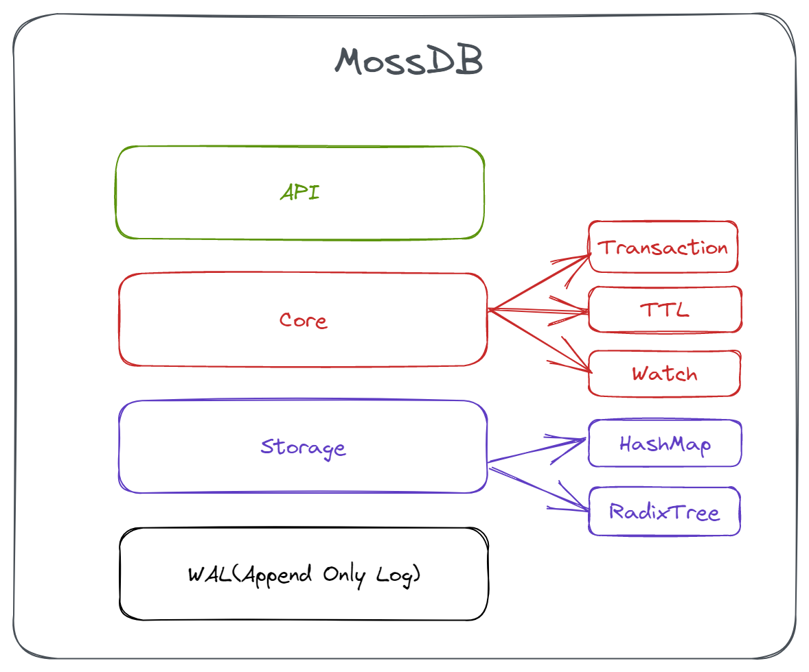

# MossDB

MossDB is a in-memory, persistent and embedded key-value store. 

Features:
- Key-value memory store, just use a simple map to store key/value
- Transactions supported
- AOL persistent, use the wal to store every commit, just like redis append-only file
- TTL supported, user can set the key with expire time that based on time heap
- Watch interface, caller will receive event when the value of key changes
- Embedded with a simple API
- Multi storage engine, now it support Map and RadixTree as backend storage 

The architecture of MossDB as follows:



## Getting Started

### Getting MossDB

To start using MossDB, just use go get:
```
go get github.com/qingwave/mossdb
```

### Using MossDB

There is a simple [example](./example/main.go) shows how to use MossDB.

```golang
package main

import (
	"context"
	"errors"
	"log"
	"time"

	"github.com/qingwave/mossdb"
)

func () {
    // create db instance
	db, err := mossdb.New(&mossdb.Config{})
	if err != nil {
		log.Fatal(err)
	}

    // set, get, delete data
	db.Set("key1", []byte("val1"))
    log.Printf("get key1: %s", db.Get("key1"))
    db.Delete("key1", []byte("val1"))
}
```

### Transactions

The database allows for rich transactions, in which multiple objects are inserted, updated or deleted. Note that one transaction allowed  at a time.

```golang
    db.Tx(func(tx *mossdb.Tx) error {
        val1 := tx.Get("key1")

        tx.Set("key2", val1)

        return nil
    })
```

### Watch

Watch interface just like etcd Watch(watch a key or prefix key), caller will receive event when the watched keys modified.

```golang
func Watch(db *mossdb.DB) {
	key := "watch-key"

	go func() {
		db.Set(key, mossdb.Val("val1"))
		db.Set(key, mossdb.Val("val2"))
		db.Delete(key)

		time.Sleep(100 * time.Second)
		db.Set(key, mossdb.Val("val3"))
	}()

	ctx, cancel := context.WithTimeout(context.Background(), 100*time.Millisecond)
	defer cancel()

	ch := db.Watch(ctx, key)

	for {
		select {
		case <-ctx.Done():
			log.Printf("context done")
			return
		case resp, ok := <-ch:
			if !ok {
				log.Printf("watch done")
				return
			}
			log.Printf("receive event: %s, key: %s, new val: %s", resp.Event.Op, resp.Event.Key, resp.Event.Val)
		}
	}
}
```

### TTL

Key with expired time in useful sometimes, MossDB use a time heap to expire key near real-time. 

```golang
db.Set("key-ttl", []byte("val-ttl"), mossdb.WithTTL(100*time.Millisecond))
```
